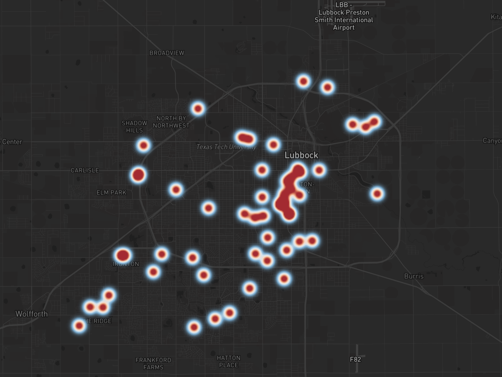

### lubbock-scanner-heatmap
Example code for building a crime heat map with police scanner
data from https://copcrawler.com



### Data
You need to replace the url `http://example.com/crime_map_data.geojson` with 
a valid url with your data in the the following geojson format.

```json
{
  "type": "FeatureCollection",
  "features": [
    {
      "type": "Feature",
      "geometry": {
        "type": "Point",
        "coordinates": [
          -101.95398493228092,
          33.57858167384062
        ]
      },
      "properties": {
        "Address": "6320 19th St",
        "Date": "2024-08-12 21:40:00",
        "Month": 8
      }
    },
  ]
}
```